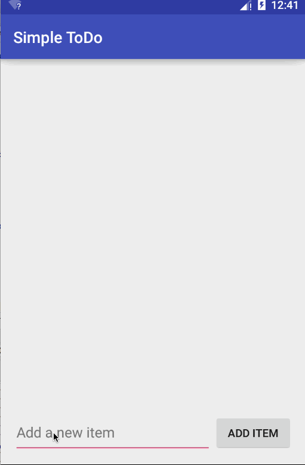

### SimpleToDoListApp

This is an android project and it enabled me in learning a bunch of android fundamentals, android dev API, diagnostic tools and more over.. the fun :-).

##### App features
* Add a new task
* Update a task
* Remove a task
* persistence data storage is assured with Sqlite3

##### Android features used in this app includes,
* Custom Adapters
* SQLLite3 (Sugar ORM instrumentation)
* DialogFragments
* Background colors and menu options on the title bar
* Various views

##### Check out the walk-through here:

